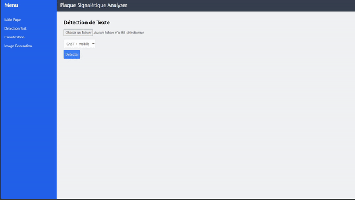
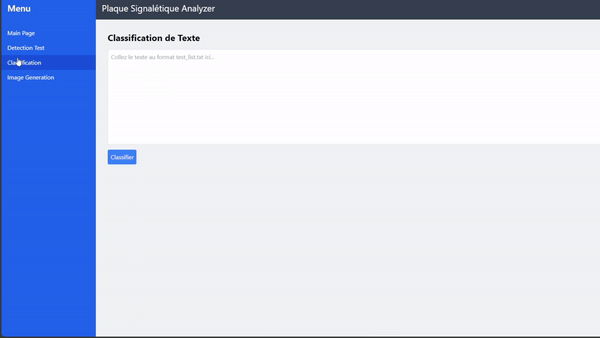
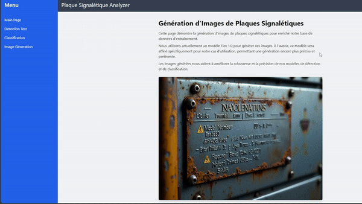

# OCR_analysis

## Description

Ce projet vise à détecter et classifier des informations spécifiques présentes sur des plaques signalétiques à partir d'images. L'application utilise **PaddleOCR** pour la détection et un modèle de classification pour identifier les éléments suivants : **Constructeur**, **Modèle**, **Numéro de série** et **Date de fabrication**. Le projet inclut également un pipeline de génération d'images pour enrichir la base de données.

## Fonctionnalités principales

- **Détection OCR** : Détecte les informations sur les plaques signalétiques.
- **Classification des éléments** : Classe les données détectées en fonction de l'élément souhaité (Constructeur, Modèle, etc.).
- **Génération d'images** : Utilise un modèle de génération d'images pour créer des exemples synthétiques.
- **Interface web interactive** : Permet de tester l'OCR et le modèle de classification via une interface web.

## Structure de l'application

L'application se compose de plusieurs pages principales :

1. **Home Page (page d'accueil)** : Introduction générale au projet et navigation vers les autres pages.
2. **OCR Detection Page** : Permet de tester l'OCR en chargeant une image. Affiche les zones détectées et le texte extrait.

3. **Classification Page** : Teste le modèle de classification. L'utilisateur peut soumettre un texte pour voir comment il est classifié.

4. **Image Generation Page** : Génère des images synthétiques de plaques signalétiques en fonction des descriptions fournies.

5. **Test intégré OCR + Classification** : Une page de test combinée (à venir), qui permet de faire la détection OCR puis de classifier automatiquement les éléments détectés.

## Prérequis

- Python 3.8 ou plus
- Node.js et npm pour l'interface frontend
- Bibliothèques Python listées dans `requirements.txt`

## Installation

1. **Clonez le dépôt** :

   ```bash
   git clone https://github.com/votre-repo-url.git
   cd votre-repo-url
   ```

2. **Installez les dépendances Python** :

   ```bash
   pip install -r requirements.txt
   ```

3. **Installez les dépendances frontend** :

   ```bash
   cd frontend
   npm install
   ```

4. **Configurez l'application** :
   - Assurez-vous que les modèles pré-entraînés sont bien en place (dans le dossier `output/fine_tuning`).
   - Vérifiez les chemins et les configurations dans `config.yml`.

## Exécution de l'application

1. **Lancez le backend** :

   ```bash
   uvicorn main:app --reload
   ```

   Le backend sera disponible à l'adresse suivante : [http://127.0.0.1:8000](http://127.0.0.1:8000).

2. **Lancez le frontend** :

   ```bash
   cd frontend
   npm start
   ```

   Le frontend sera accessible à l'adresse suivante : [http://localhost:3000](http://localhost:3000).

## Utilisation des pages

- **OCR Detection Page** : Chargez une image et cliquez sur le bouton de détection. Les résultats seront affichés avec les boîtes de délimitation autour des textes détectés.
- **Classification Page** : Entrez un texte ou soumettez un extrait détecté pour le classifier en un des quatre éléments recherchés.
- **Image Generation Page** : Fournissez une description (prompt) pour générer une image de plaque signalétique.
- **Test intégré** : (Fonctionnalité à venir) Combine la détection OCR et la classification en un seul flux.

## Développement futur

- Intégration du test combiné OCR + Classification.
- Optimisation de la génération d'images.
- Ajout d'une fonctionnalité de reinforcement learning pour améliorer la précision des modèles en utilisant des nouvelles images.

## Contribution

Les contributions sont les bienvenues ! Veuillez soumettre une pull request ou ouvrir une issue pour discuter de vos idées.

